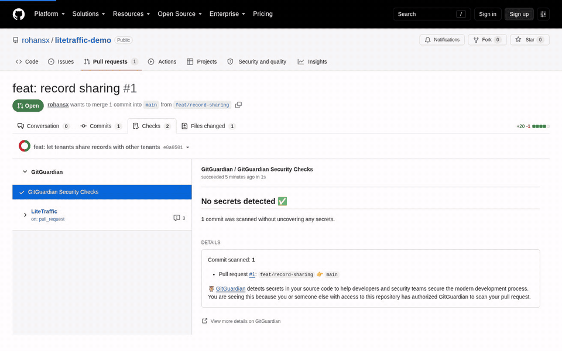

# LiteTraffic

**Users as an API.** LiteTraffic sends stateful synthetic users through your running app on a seeded, repeatable schedule, then checks what actually happened: the charge that was recorded twice, the order that sold past stock, the write that returned 403 but landed anyway. Every HTTP call can return 200 while the business effect is wrong; LiteTraffic checks the effect. It runs stock k6 for the traffic, writes a JSON verdict and a standalone HTML report for each run, and exits with the verdict so CI can gate on it.



[Documentation](docs/README.md) · [Quickstart](docs/quickstart.md) · [CLI reference](docs/cli.md) · [CI recipe](docs/ci.md) · [Self-hosting](docs/self-hosting.md) · [MIT license](LICENSE)

> **Developer preview — `0.1.0.dev0`.** The current CLI provides `doctor`, `init` (generate a tenant-isolation scenario from a small JSON config), `inspect`, `verify`, `up` (repeated bounded slices until Ctrl-C, no verdict), `approve` (local scenario-digest approvals), `diff`, `prune` (run retention), and a local read-only `dashboard` for browsing run artifacts on `127.0.0.1`. Scenarios are handwritten, or generated by `init tenant-isolation`, and reviewed. Automatic repository discovery, AI authoring, persistent-user population mode, and sandbox provisioning are planned, not implemented.

## What it catches that status-code checks miss

Each row is a bundled example with a deliberate fault flag; the conformance tests run every one and expect `fail`.

| Bug | What the HTTP responses say | What LiteTraffic checks | Example |
|---|---|---|---|
| Tenant leak, and cross-tenant writes that return 403 but are applied | 200 on your own records, 403 on others' | Cross-tenant reads and writes are refused, and the other tenant's record is unchanged afterwards | [`tenant_api`](examples/tenant_api) (`--wrong-leak`, `--wrong-silent-write` via `init tenant-isolation`) |
| Duplicate charge on a retried payment | 201, then 200 on the retry | The ledger holds exactly one effect per payment | [`checkout`](examples/checkout) (`--wrong-duplicate`) |
| Oversell under concurrent reservations | 201 for every accepted reservation | Accepted reservations never exceed capacity | [`inventory`](examples/inventory) (`--wrong-oversell`) |
| Stale cache after an update | 200 with a body | A read after the update returns the new value | [`cached_search`](examples/cached_search) (`--wrong-stale`) |
| Partial report | 200 with rows | Every row and the totals are present and match the final ledger | [`reporting`](examples/reporting) (`--wrong-partial`, `--wrong-ledger`) |
| The same checks against a real application | — | Tenant isolation and a counted write effect on a stock Gitea container | [`gitea`](examples/gitea) (grant a collaborator to see it fail) |

## 60-second quickstart

**With Docker** (k6 v2.2.0 is bundled): start the checkout example, then verify it on Linux.

```bash
git clone https://github.com/rohansx/litetraffic.git && cd litetraffic
python3 examples/checkout/server.py --port 8765 &
docker run --rm --network host --user "$(id -u):$(id -g)" -v "$PWD:/work" \
  ghcr.io/rohansx/litetraffic:main verify examples/checkout --target http://127.0.0.1:8765 --seed 42
```

No Python on the host? `cd examples/compose && mkdir -p .litetraffic/runs && docker compose up --build --exit-code-from verify` runs the same thing entirely in containers.

**With pip** (Python 3.11+, and [k6 v2.2.0](docs/installation.md#install-k6) on `PATH`):

```bash
python3 -m pip install "litetraffic[ai] @ git+https://github.com/rohansx/litetraffic@main"
litetraffic doctor
git clone https://github.com/rohansx/litetraffic.git && cd litetraffic
python3 examples/checkout/server.py --port 8765 &
litetraffic verify examples/checkout --target http://127.0.0.1:8765 --seed 42
```

Expected result: `verdict: PASS`, 12 of 12 journeys, and a report path under `.litetraffic/runs/<run_id>/`. Now restart the server with `--wrong-duplicate` and verify again. Every HTTP call still succeeds, but the verdict is `FAIL`, and each failed `one_effect_per_payment` sample records the expected and actual effect count:

```json
{"actual": 2, "detail": null, "expected": 1, "logical_key": "<run_id>-traffic-0", "sequence": 2}
```

The [quickstart](docs/quickstart.md) walks through reports, repeated seeds, comparisons, and all five examples. The example servers are intentionally small and are not production services. To use your own app, write a scenario for its API: see [adapting a scenario](docs/scenarios.md).

## Run it in CI

`litetraffic verify` exits with the verdict, so a CI step needs no parsing: `0` pass, `1` fail, `2` inconclusive (evidence missing, which is not a pass), `3` error or bad input, `130` cancelled. The [CI recipe](docs/ci.md) is a complete GitHub Actions workflow with a job summary and the run folder kept as a build artifact; [self-hosting](docs/self-hosting.md#in-ci) shows the same job using the container image.

## The local dashboard

```bash
litetraffic dashboard   # http://127.0.0.1:8780/
```

A read-only viewer over `.litetraffic/runs`, bound to `127.0.0.1` only. Each run page shows the verdict, assertions with their failing samples (expected vs actual), observations, metrics, and limitations. The **Journeys** tab shows how far journeys got, the **Server** tab shows captured container logs and resource use, and **Explain with AI** writes a plain-English account of the run using `ANTHROPIC_API_KEY`, `OPENAI_API_KEY`, or a local `claude`/`codex` CLI; nothing is sent anywhere unless you press it. Compare two runs side by side, or follow a scenario's p95 over time. [Dashboard reference](docs/cli.md#dashboard).

## Server capture and journey funnel

`verify --capture docker:api,worker` records the named containers' logs and CPU/memory for the run window into `server.json`: baseline and peak usage, error-line counts, and the top repeated error signatures, scrubbed of the run's secrets. Capture is evidence only and never changes the verdict. [Server capture](docs/results.md#server-capture).

A journey can declare ordered `stages` (for example `paid`, `retried`, `confirmed`) and report them from its script with `lt.stage(name)`. The run then records how many journeys reached each stage, so a failure points at a step, and a run whose checks passed while no journey reached its final stage is `inconclusive`, not a silent pass. [Journey funnel](docs/results.md#journey-funnel).

## What it does

- Runs stateful k6 journeys with identities, response chaining, retries, and declared business assertions.
- Resolves explicit phases or seeded **spiky**, **random-burst**, and **sustained-burst** traffic profiles.
- Checks declared request, write, and duration budgets before running; after the run, checks requests, writes, k6 `vus_max` against the concurrency budget, and artifact size, and reconciles delivered journeys and collected evidence. Budgets are declared bounds checked before and after the run, not hard containment: a script that ignores them can overrun before the controller notices (only the `max_seconds` deadline is enforced while k6 runs). `up` budgets apply per slice, not to the whole activity.
- Sets up run state with run-owned HTTP fixtures, `fixtures.command` setup/teardown commands, or a per-journey `fixtures.pool`.
- Mints an HS256 JWT per actor class from an actor's `auth` recipe, or with `per_identity` one per actor (`count` distinct identities).
- Checks final state with HTTP observations, optionally polled with `until` until they converge or a bounded deadline passes: equality or `eq`/`gte`/`lte`/`len`/`exists` matchers, expected values written as `${planned_journeys}` expressions, and an optional second origin listed in `allowed_origins`.
- Runs a client-side overlap check: reports peak in-flight requests per operation and holds back a pass when a journey's `min_overlap` was not reached. It shows requests were in flight together, not that the server executed them concurrently; `expected_statuses` separates intended HTTP rejections from unexpected failures.
- Preserves run metadata, the manifest, metrics, assertion events, diagnostics, and a readable report.
- Repeats across consecutive (or the same) seeds and compares compatible baseline/candidate runs, with an optional p95 regression gate.
- Targets localhost, reachable HTTP/HTTPS previews, or an existing E2B sandbox's application port.

Running scenarios needs **no LLM key, E2B account, or hosted LiteTraffic account**. Secrets stay in environment variables: a manifest names them (`secret_env`, `bearer_token_env`, `headers_env`) and never holds a value, and declared credentials and minted tokens are replaced with `[redacted]` in run artifacts ([actor auth](docs/scenarios.md#actor-auth)). Scenarios are executable, trusted code; manifest budgets are not a sandbox ([safety and limitations](docs/safety.md)). Linux is the verified environment; [requirements](docs/installation.md).

## Self-hosting

LiteTraffic runs entirely on your machine or CI runner. The image `ghcr.io/rohansx/litetraffic` bundles the CLI and the checksum-verified k6 v2.2.0; [self-hosting](docs/self-hosting.md) covers `docker run`, Docker Compose, CI with the image, and viewing results.

## LiteTraffic Cloud

A shared team dashboard with login and run history across machines is coming as LiteTraffic Cloud (and later a self-hosted edition). [Join the early-access waitlist](https://litetraffic.com/pricing#waitlist).

## Documentation

- [Installation](docs/installation.md) · [Quickstart](docs/quickstart.md) · [Results and reports](docs/results.md)
- [Writing scenarios](docs/scenarios.md) · [CLI reference](docs/cli.md) · [CI recipe](docs/ci.md) · [Self-hosting](docs/self-hosting.md)
- [Architecture](docs/architecture.md) · [Safety](docs/safety.md) · [Troubleshooting](docs/troubleshooting.md) · [Roadmap](docs/roadmap.md)

## Development

```bash
python -m pip install -e '.[dev]'
python -m pytest -q -m "not real_k6"
```

The suite uses engine doubles and needs no live target or k6. The `real_k6`-marked conformance tests start every example server, reference and each fault flag, and expect `pass` and `fail`; they run when k6 v2.2.0 is on `PATH` (`python -m pytest -q -m real_k6`). The dashboard UI lives in `web/` (Node 26, pnpm 11) and its build is committed under `src/litetraffic/dashboard_ui/`, so Node is only needed to change it. See [CONTRIBUTING.md](CONTRIBUTING.md).

## License

LiteTraffic is [MIT](LICENSE). k6 is a separate AGPL-3.0 tool: installed separately for pip installs, and included unmodified as a separate executable in the container image. [Third-party notices](THIRD_PARTY_NOTICES.md).
