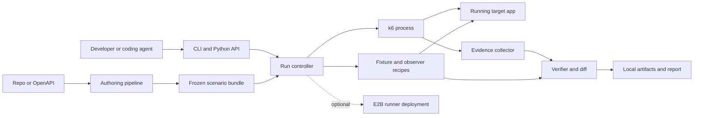
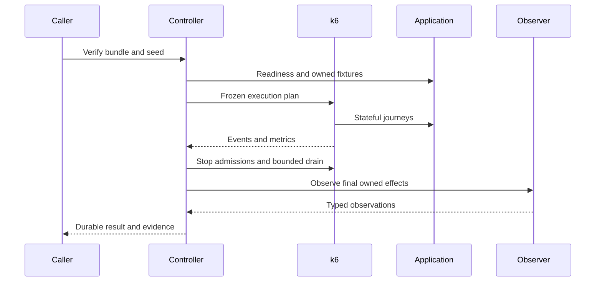

# LiteTraffic

## Standalone product technical specification

18 September 2026 · Design proposal · Independent repository and distribution

**LiteTraffic gives a running application a reproducible population of stateful users and verifies the effects of their actions.** It runs on a developer's machine, in CI, or beside an application in a sandbox. It does not require an assessment platform, a hosted LiteTraffic account, a particular database, or E2B.

This document supersedes the assessment-oriented document as the product architecture. It can be copied directly into a new LiteTraffic repository. All APIs, schemas and commands below are proposed interfaces, not currently released functionality. Public documentation was researched; no engine benchmark or product implementation was performed for this document.

## 1. Product boundary

The primary user is a developer or coding agent changing a running HTTP application. Their job is: create realistic activity, reproduce a meaningful workload, change the code, and determine whether behaviour improved without losing correctness.

The product has two distinct capabilities:

- **Population:** actors with identities, weighted behaviours, owned entities and bounded lifecycles make an application look used.
- **Verification:** a finite experiment uses a frozen population and schedule, then checks independent expectations against client observations and final application state.

Population mode can be useful without business assertions. Verification cannot claim business correctness without them. The UI and CLI must make that distinction visible.

The first release supports HTTP/JSON services with either OpenAPI or accessible source, test authentication, and a safe fixture strategy. Source language does not constrain runtime support: a Go, Python, Java or Node application is usable if its API contract and test setup are available. Authentication that requires interactive browser challenges and applications with no safe test-data boundary are unsupported initially.

“E2B + ShadowTraffic” is a product analogy: disposable execution environments plus believable synthetic activity. LiteTraffic does not fork E2B, recreate its infrastructure, or wrap the ShadowTraffic container. It supplies the application users and verification layer above an already running target.

### Non-goals for v0.1

No hosted control plane, billing, organisation management, browser automation, distributed maximum-load generation, production replay, arbitrary event-bus producers, universal database seeding, runtime LLM calls, or unrestricted fault-injection framework. HTTP interfaces may exercise systems that internally use queues; final queue effects need an explicit observer.

A standalone product does not require a SaaS. The first complete distribution is a local CLI with a reusable Python API, portable scenario bundles and exported reports.

## 2. Research conclusions and differentiation

### What existing tools already solve

| Tool | Verified capability | Decision |
|---|---|---|
| k6 | HTTP execution, open-arrival iteration scheduling, stages, metrics, checks and thresholds | Use as the execution process |
| k6 authoring tools | OpenAPI-to-k6 client generation; AI skills and MCP integration through `k6 x agent` | Evaluate as authoring aids; do not claim script generation is novel |
| ShadowTraffic | Declarative synthetic events, weighted choices, forked generators, state machines and schedules | Borrow modelling concepts; implement an app-client model independently |
| Locust | Stateful Python users and HTTP sessions | Alternative only if k6 fails measured requirements; ordinary user loops are not an equivalent open-arrival model |
| Artillery | HTTP flows, capture and response chaining | Chaining is established functionality, not our differentiator |
| Schemathesis / RESTler | Stateful API tests and operation dependency inference | Potential authoring inputs; no need to bundle multiple engines |
| Speedscale / GoReplay | Capture and replay workflows | Different starting point; Speedscale also supports local/staging capture, not just production |
| E2B | Cloud sandbox control through SDKs | Optional deployment integration, outside core execution semantics |

Primary sources: [k6 arrival allocation](https://grafana.com/docs/k6/latest/using-k6/scenarios/concepts/arrival-rate-vu-allocation/), [k6 agent setup](https://grafana.com/docs/k6/latest/set-up/configure-ai-assistant/bootstrap-with-k6-x-agent/), [OpenAPI-to-k6](https://grafana.com/docs/k6/latest/using-k6/test-authoring/create-test-script-using-openapi/), [ShadowTraffic state machines](https://docs.shadowtraffic.io/functions/stateMachine/), [Locust](https://docs.locust.io/en/stable/api.html), [Artillery HTTP](https://www.artillery.io/docs/reference/engines/http), [Schemathesis](https://schemathesis.readthedocs.io/en/latest/guides/stateful-testing/), [RESTler](https://github.com/microsoft/restler-fuzzer/blob/main/docs/user-guide/Compiling.md), [Speedscale](https://docs.speedscale.com/), [GoReplay](https://github.com/probelabs/goreplay), [E2B repository](https://github.com/e2b-dev/E2B).

The original overview's “nobody owns this” should be treated as a hypothesis. There is strong adjacent tooling. The defensible product experiment is whether LiteTraffic can reliably turn an unfamiliar app into **owned fixtures + believable journeys + calibrated timing + a useful independent verdict**, with substantially less work than using those tools directly.

### ShadowTraffic: what “borrow” means

Its public [GitHub organisation](https://github.com/ShadowTraffic) and [examples](https://github.com/ShadowTraffic/shadowtraffic-examples) are research references; the reviewed repositories did not expose the production engine source. The [webhook documentation](https://docs.shadowtraffic.io/connections/webhook/) establishes HTTP delivery, but does not establish the arbitrary response-value chaining needed for our user sessions. We should not infer that capability or build around it.

| Modelling idea | LiteTraffic implementation |
|---|---|
| Weighted generators | Actor classes and journey weights; explicit hot/cold or small/large entity classes |
| Forked stateful generators | Many logical actors, each with bounded journey-local state |
| Entity relationships | Fixture references and response captures such as cart ID → checkout request |
| State machines | Explicit transitions driven by declared response conditions; bounded loops |
| Time stages | Frozen constant/ramp/burst/plateau journey-admission plans |
| Reproducibility | Versioned bundle, seeded input generation, engine lock and recorded effective schedule |

We borrow these general ideas, not source code, JSON syntax or a commercial runtime. LiteTraffic must react to application responses and distinguish intended actions from persisted effects.

### Build versus reuse

**Build:** scenario authoring workflow, fixture ownership, a small compiler, business assertions, evidence collection/reduction, calibration records, run comparison and product UX.

**Reuse:** k6 networking/scheduling, Python process/file/JSON primitives, Pydantic validation and schema generation, HTTPX for preparation and observations, the selected LLM provider's SDK at authoring time, optional E2B SDK for provisioning.

**Do not build:** a scheduler, HTTP stack, VM platform, generic AST framework, telemetry backend, SQL console, plugin marketplace, or engine abstraction before a second engine is actually required.

## 3. Technology and distribution decisions

Choose **Python for the CLI/controller and authoring pipeline; JavaScript for generated k6 journeys**. This creates a clear process boundary and keeps fixtures, observers and future agent integrations straightforward. k6 JS is not Node.js: generated scripts use only pinned k6 APIs and bundled helpers, with no assumption that npm modules work at runtime.

Alternatives considered:

| Option | Benefit | Cost | Verdict |
|---|---|---|---|
| Python controller + k6 | Mature scheduling; simple CLI and data analysis; no custom networking | Two runtimes and event transport to validate | Recommended |
| Python + Locust | One implementation language; flexible user logic | Need to establish promised open-arrival and evidence semantics separately | Keep as contingency, not a second adapter now |
| TypeScript product + k6 | Familiar to web developers and agent SDK consumers | Still two different JS environments; no clear first-release capability advantage | Reasonable alternative if the implementation team strongly prefers TS |

Proposed package: Python 3.11+, `pyproject.toml`, console entry point `litetraffic`. Base dependencies are Pydantic and HTTPX. Optional extras add a chosen authoring-provider SDK or E2B; verification of an existing bundle needs neither an LLM key nor an E2B key. Use `argparse`, `subprocess`, `pathlib`, `hashlib`, `json`, `sqlite3` only if indexing is needed, and ordinary file locks/atomic writes where supported. Start without a local database.

Ship source-installable packaging first. Proposed installation is `pipx install litetraffic` once the package name is reserved and published; this command is a product target, not a claim that a package exists. `litetraffic doctor` checks Python, the supported k6 release, permissions, target connectivity and available disk. It does not install binaries silently.

Initially require an officially installed compatible k6 executable via `--k6-path` or PATH. A later combined container may simplify installation after licensing review. Pin tested engine versions and checksums; record the actual binary version in every run. No automatic upgrades during a run, extension fetching, or remote JS imports in frozen scenarios.

k6 is [AGPL-3.0](https://github.com/grafana/k6/blob/master/LICENSE.md). Separate-process execution is not a legal guarantee about distribution obligations. Before public packaging, decide LiteTraffic's own license, review all bundled components, and satisfy applicable notice/source obligations. E2B's repository lists Apache-2.0, but optional cloud use also has its own service terms. Do not select a public license solely to imitate another product.

## 4. Architecture and trust boundaries



These are modules in one package plus the k6 child process, not independent network services.

**Authoring plane:** gathers evidence, proposes a bounded scenario, probes it in an approved test environment, and freezes reviewed inputs. It may call an LLM.

**Execution plane:** validates provenance, prepares fixtures, starts the engine, captures events and performs final observations. It has no LLM dependency.

**Evidence plane:** stores immutable inputs and observations, evaluates explicit assertions, and produces results. Its expected values come from approved contracts/fixtures, not whatever the target happens to return.

**Integration boundary:** callers supply a target URL, approved bundle, run configuration and artifact destination. A shell command is the universal first integration. A Python library calls the same functions. An E2B wrapper supplies a reachable target and isolated execution. No core module imports a customer backend.

Run the controller and verifier outside the application being tested. When an agent can change application code, keep the approved scenario and expected values outside that agent's writable checkout for trustworthy evaluation. A local developer can of course edit both; LiteTraffic is not a tamper-proof attestation product in that deployment.

### Proposed independent repository

```text
litetraffic/
  pyproject.toml
  src/litetraffic/
    cli.py
    models.py
    author.py
    compile.py
    runner.py
    evidence.py
    verify.py
    k6/runtime.js
  examples/
    reporting/
    cache/
    payments/
    inventory/
    tenant-api/
  integrations/e2b/       # add after local contract works
  tests/
  docs/
```

Do not scaffold every directory before the first vertical slice. This layout describes ownership and extraction boundaries; merge tiny modules until separation helps.

## 5. User workflow and public interfaces

### First use

The app is already running. LiteTraffic does not guess how to build and execute an arbitrary repository.

```text
litetraffic doctor --target http://localhost:3000
litetraffic author --repo . --target http://localhost:3000 --out ./traffic
litetraffic inspect ./traffic
litetraffic approve ./traffic --target-profile local-test
litetraffic up --scenario ./traffic --target http://localhost:3000
litetraffic verify --scenario ./traffic --seed 42 --json
litetraffic diff run_a run_b --json
```

`up --repo .` is the eventual shorthand: reuse a valid approved bundle, or run authoring first and stop at a reviewable plan if approval is missing. It must not silently generate arbitrary writes. Interactive approval records the bundle digest and target profile; noninteractive agents/CI supply an already approved digest. A changed contract invalidates approval.

### Required inputs

| Input | Mandatory when | Example |
|---|---|---|
| Target URL | Every execution | Localhost, container network URL or sandbox endpoint |
| Scenario bundle | Every runtime run | Handwritten first; generated later |
| Source or API description | Automatic authoring | Repository path or OpenAPI file |
| Test auth recipe | Authenticated operations | Environment-referenced tokens or explicit login flow |
| Fixture strategy | Writes or known-data correctness checks | Owned namespace creation or isolated reset/seed recipe |
| Business contract | Business verification | Capacity, expected totals or one effect per logical payment |
| Observer | Client-visible API cannot establish truth | Read-only scoped export or DB query recipe |
| LLM credentials | Built-in model authoring only | Chosen provider configured locally |

The operator need not add application instrumentation to run HTTP scenarios. Correlated logs/traces are optional diagnostic integration, not a prerequisite for using the product.

### Command semantics

| Command | Contract |
|---|---|
| `author` | Produce a draft bundle plus coverage/assumptions; no hidden approval |
| `inspect` | Explain actors, writes, schedule, budgets, assertions, secrets and unsupported operations |
| `approve` | Bind reviewed bundle digest to target profile and allowed capabilities |
| `up` | Foreground background-activity process by default; emits status and artifact path |
| `verify` | Finite experiment; prepare, execute, observe, evaluate, persist and exit |
| `diff` | Compare compatible immutable run directories/IDs; no target access |
| `doctor` | Check prerequisites without application writes |

Use Ctrl-C or the caller's process handle to stop `up`; do not build a daemon manager first. A service manager can supervise it later. Persist a workspace selection so omitted target/scenario flags resolve deterministically, and always print the resolved values.

`--json` produces one terminal JSON object on stdout; progress uses stderr. Exit codes: 0 pass/completed activity, 1 observed assertion failure, 2 inconclusive, 3 invalid configuration or runner error, 130 interrupted. Activity completion must say `mode=background`, not `verdict=pass`.

Proposed Python surface: `verify(target, bundle, seed, output_dir) -> RunResult`, `compare(run_a, run_b) -> Comparison`, and a context-managed `start_activity(...)` handle with `stop()`/`status()`. Validate through the same models and execute the same controller. Do not maintain separate SDK semantics. TypeScript consumers initially invoke the CLI with JSON; add a native SDK only when an actual integration needs it. MCP is a later thin wrapper, not the core API.

## 6. Scenario model and format evolution

Five hand-authored bundles establish the model before a general DSL. A bundle is versioned data plus reviewed scripts and fixture/observer recipes. Generated scenarios eventually use a bounded intermediate representation compiled into the same k6 helper calls.

| Concept | Required semantics |
|---|---|
| Actors | Identity class, auth recipe, stable fixture selection and behaviour weights |
| Fixtures | Entity relationships, distributions, ownership, initial expected state and reset/cleanup rules |
| Operations | Method/path, typed inputs, captures, expected response classes, retry policy and bounded transitions |
| Timing | Journey admission schedule, think-time bounds, phases, seed and concurrency envelope |
| Assertions | Expected values, observation source, deadlines, positive-progress requirements and evidence fields |
| Budgets | Duration, HTTP/write attempts, fan-out, fixture growth, artifact size and allowed origins |

Keep target bindings and secrets out of the portable behavioural bundle. The same scenario may run against localhost and a remote preview; calibration/environment compatibility determines whether their performance is comparable.

### Example v0 manifest

This is an illustrative handwritten-bundle schema. The implementation must validate all referenced recipes and prove budget bounds before execution.

```json
{
  "schema_version": 1,
  "name": "checkout",
  "script": "journeys.js",
  "actors": [{"class": "buyer", "count": 50, "auth_recipe": "test-login"}],
  "fixtures": {"recipe": "owned-shop", "parameters": {"small_carts": 80, "large_carts": 20}},
  "journeys": [{"name": "purchase", "max_requests": 7, "max_writes": 3}],
  "schedule": {
    "unit": "journeys_per_second",
    "phases": [
      {"name": "warmup", "seconds": 10, "rate": 1},
      {"name": "measure", "seconds": 120, "rate": 2},
      {"name": "recovery", "seconds": 20, "rate": 1}
    ]
  },
  "assertions": ["one_effect_per_payment", "accepted_orders_persist", "order_totals_match"],
  "observer": "owned-order-ledger",
  "budgets": {
    "max_seconds": 210,
    "max_requests": 2400,
    "max_write_attempts": 900,
    "max_in_flight": 8,
    "max_artifact_bytes": 67108864
  }
}
```

There are at most 270 planned journeys in this example: 1,890 journey requests and 810 journey writes at their maxima. Preparation, authentication not already counted in a journey, final observations and cleanup must fit the remaining allocations. Reject the bundle if their declared bounds do not fit. Numbers illustrate accounting, not recommended load for every shop.

A proposed later operation representation needs only literal/fixture/capture inputs, JSON Pointer response extraction, expected statuses, finite retries/polls and a small transition table. Do not add arbitrary evaluated expressions. Start with JSON; expose YAML only if users need it and keep canonical JSON for hashing.

### Identity and capture rules

A journey ID is `(run_id, scenario, admitted_iteration)`. An actor ID selects a logical identity independently of which VU executes it. A payment retry retains the same business key and payload digest; a new logical purchase gets a new key.

Captures are journey-local, typed, and fail closed when absent. An ID captured from `/orders` may populate an approved path segment; it cannot become an arbitrary destination URL. Encode path/query values through fixed templates. Each iteration establishes its intended actor's authentication rather than inheriting an accidental VU session.

Mutable state across arbitrary journeys is not initially supported. Recurring users reuse immutable identity fixtures; response-dependent lifecycles remain within a bounded journey. Shared mutable inventory lives in the app and is checked by an observer. This is an explicit limit to “stateful users”, not hidden shared-memory magic.

## 7. Authoring is the main product investment

A generic product needs a first-class authoring contract, not an internal task-generation hook. Inputs are an unfamiliar app, its API/source evidence, and the operator's test intent. The output is a reviewable executable hypothesis with honest coverage.

### Pipeline

1. **Inventory.** Prefer supplied OpenAPI. For source-only apps, select bounded route/model/auth/seed files, record source references, and let the model propose operations. Ignore secrets, dependencies and generated files. Do not execute repository setup scripts automatically.
2. **Relationship graph.** Identify producer/consumer IDs, identities, ownership boundaries and likely entity lifecycles. Track whether each edge came from schema, source, user instruction or a successful probe.
3. **Behaviour proposal.** Suggest actor classes, journey mix, fixture skew and known failure hypotheses. Start with the requested workflow rather than every discovered route.
4. **Contract proposal.** Separate protocol assertions from business assertions. A response schema can establish field types; it cannot establish the correct tax calculation or tenancy rule by itself.
5. **Fixture planning.** Select supplied fixtures, namespace creation, or a user-provided disposable reset recipe. If none is safe, propose read-only activity with explicitly limited verification.
6. **Probe.** Test operations and captures at minimal pressure in an approved disposable environment. Probing writes requires the same ownership limits as runtime. Retain failing intended paths as findings; never remove them just to report a successful scenario.
7. **Compile and validate.** Check references, finite loops, resource bounds, route policy and instrumentation coverage. Use trusted code templates for generated runtime behaviour.
8. **Review, calibrate and freeze.** Present expected effects and unresolved assumptions; bind approval to the final digest; store reproducible artifacts.

Draft states: `discovered → proposed → probed → reviewed → calibrated → frozen`. A changed operation or oracle returns to review; a new target resource class requires recalibration for latency, not necessarily a new business contract.

### Model contract and cost

Use one configured model provider initially; no home-grown model gateway. Record provider/model, prompt version, input file digests and output validation errors. Do not store secret-bearing prompt bodies in reports. Restrict source transmission to the user's selected provider and explicitly selected workspace content. Support imported/handwritten bundles so runtime works fully offline.

Proposed default repair budget: two model revisions per failed operation, a configurable total token/spend ceiling, and a finite probe count. Exhaustion produces a draft with unsupported operations, not endless retries. Model output is untrusted data: it cannot authorize shell commands, disable policies or approve its own business assertions.

### Coverage report

Report discovered operations, attempted operations, executable operations, exercised relationships, observed actor classes, unsupported auth, skipped mutations, and assertions with no independent oracle. Include confidence/provenance per inferred rule. “18 of 23 routes executed” must not be presented as “78% of business behaviour verified”.

For the first generic milestone, support OpenAPI plus static/test-login authentication and an explicit fixture recipe well. Add framework-specific extraction only when five outside apps show a repeated gap. Do not promise arbitrary repositories from day one.

## 8. Execution engine and scheduling

One controller launches one pinned k6 process. The controller writes an immutable resolved plan, prepares fixture data, starts bounded execution and consumes event/metric streams. VUs execute complete journeys.

k6 arrival executors admit **iterations**, not individual HTTP requests. A journey's number of requests depends on steps, retries and polling. Show both planned journeys/second and observed HTTP requests/second. Open scheduling avoids automatically slowing admissions merely because responses slowed, but sufficient VUs are required. Insufficient capacity creates dropped iterations, which are evidence of under-delivered load, not completed work. [Official scheduling semantics](https://grafana.com/docs/k6/latest/using-k6/scenarios/concepts/arrival-rate-vu-allocation/).

Use constant and ramping arrival executors. Precompute seeded burst placement, amplitude and plateau lengths, then freeze the stage plan. Within-stage regular admissions are not a Poisson process; describe them accurately. Preallocate the required VUs to avoid dynamic VU allocation changing the measurement environment.

Derive randomness from independent streams keyed by seed, scenario and iteration identity. A slow response must not shift all subsequent data choices. Fixed seed reproduces inputs and planned admissions, not thread scheduling or identical latency.

k6 VUs do not share mutable JS state. `SharedArray` provides read-only data, and setup values do not provide a shared result registry. [Lifecycle](https://grafana.com/docs/k6/latest/using-k6/test-lifecycle/) and [SharedArray](https://grafana.com/docs/k6/latest/javascript-api/k6-data/sharedarray/). Use journey-local state and external evidence reduction.

### Budget enforcement

Before running, calculate the maximum calls/writes per journey, admitted slots per phase, setup/observer/cleanup allocations and parallel fan-out. The helper rejects iterations beyond their slot budget and caps retry/poll loops. Sum concurrent scenarios' `VU limit × maximum per-VU parallel requests` to bound in-flight work. There is no fake global counter in VU memory.

This limits client attempts, not arbitrary downstream side effects caused by a broken app. Fixture isolation and target resource limits remain necessary. A strict global HTTP-RPS admission limit would require an additional coordination design; do not advertise one based only on journey rates.

For contention, use independent VUs or bounded `http.batch`. Record actual dispatch intervals and require overlap on the same resource; a “burst” label does not prove a race was exercised. [Batch API](https://grafana.com/docs/k6/latest/javascript-api/k6-http/batch/).

### Timing completeness

Collect scheduled/admitted/completed/dropped journeys and measured starts per phase. Exact late-start accounting must be proven against the pinned executor: skipped arrivals cannot simply be reconstructed from the ordinal of executed iterations. Engine-fit testing must establish a reliable expected-slot mapping or instrumented scheduling signal. If unavailable, report aggregate delivery and explicitly mark per-arrival lateness unsupported; do not claim it is measured.

## 9. Calibration and realistic populations

A workload is `population × journey mix × time profile`. Prefer explicit interpretable classes before fitting elaborate distributions: 80% small carts and 20% large carts; hot keys receiving most reads; two tenants sharing the same local ID; a small inventory receiving simultaneous demand.

Borrow skew as a modelling idea, but determine parameters from the app's intended use or the operator's supplied traces/statistics. In the absence of those, label the workload synthetic and hypothesis-driven. “Believable” does not mean a faithful reconstruction of unknown production behaviour.

Calibration prepares isolated fixtures, runs a small fixed pressure ladder, measures runner overhead and target behaviour, and freezes a selected envelope. Never continuously reduce verification pressure until a broken app passes. Without a known-good reference, calibration can establish an operational envelope but cannot invent the product's business or latency requirements.

A stable interval offers the sizing estimate `average in-flight ≈ journey arrival rate × average journey duration`. Add headroom for tails and fan-out. When the target saturates, this is a diagnostic relationship rather than a capacity guarantee.

Define warmup, measurement, recovery and final observation separately. The default verification measurement is 1–5 minutes; preparation may take longer and must be reported separately. Measure per route, actor/data class and phase. Preserve errors and timeout denominators so dropping work cannot look faster.

A proposed pilot floor is 200 observations per p95-gated class; it is not a confidence guarantee. Insufficient samples produce inconclusive performance checks. Do not infer useful p99 estimates from a tiny run. Use repeated runs and reported dispersion for noisy small machines.

Thresholds come from a stated requirement or reviewed baseline policy and are locked before the code change. Without thresholds, report comparative measurements rather than manufacture a pass. Server instrumentation can explain latency; external request duration is the independently observed user experience.

## 10. Fixture, authentication and observer contracts

### Fixture strategies

| Strategy | Requirements | Claims available |
|---|---|---|
| Read-only existing data | Supplied safe identities/resource references | Activity and observable protocol checks; only known expected values support correctness |
| Owned API-created namespace | Proven creation/ownership and bounded cleanup | Stateful writes scoped to synthetic resources |
| Disposable reset/seed recipe | Explicit operator-approved command in isolated app environment | Reproducible full known-state experiments |
| External supplied fixture manifest | Trusted expected entities and ownership | Portable repeatable runs without generic seeding |

A fixture recipe returns namespace, actor secret references, owned entity references, expected values, initial counts, version and cleanup metadata. Secrets are stored separately. Ownership must be established by the recipe/validated creation context, not merely an ID returned by the untrusted app.

Cleanup only targets owned objects. A failed cleanup reports leftovers and preserves the evidence. Do not recursively reset a developer's database from a guessed command. Compare runs using equivalent initial states; run-specific namespaces may differ physically while logical fixture values and distributions remain identical.

### Authentication

Start with environment-supplied bearer/API tokens and explicit test-login HTTP recipes. Define extraction, session expiry and bounded reauthentication. Cookie state belongs to the intended logical actor. CSRF/OAuth flows need a supplied tested recipe; no automatic bypass. Reauthentication consumes budget and cannot silently switch to an administrator identity.

### Observers

A client ledger cannot prove hidden persistence. An observer obtains final truth through an independently specified API/export or a user-supplied read-only database recipe. Generic v0 should not contain a SQL generator with broad credentials. A trusted executable observer is an explicit opt-in, run with the minimum credentials and a timeout; it reads a fixed request JSON and returns validated observation JSON.

Observer input: run ID, owned namespace, expected logical keys and deadline. Output: schema version, observation timestamp, source identity, completeness, typed records and errors. Missing or incomplete records cannot be treated as zero effects without the observer proving the query's scope was complete.

Application logs and metrics are optional diagnostic signals. They cannot certify a business assertion merely because the application says “success”. Request IDs belong in logs/traces; use bounded route/status/class labels in metrics. [OpenTelemetry instrumentation](https://opentelemetry.io/docs/concepts/instrumentation/).

## 11. Evidence pipeline and verdicts

Every generated HTTP operation goes through a shared helper. It records intent before sending, then response or transport error. IDs include run, scenario, journey, step and attempt. Store method, route template, logical resource/business key, payload digest, selected redacted response fields, elapsed time and status/error classification.

An intent is not proof that bytes reached the app. A timed-out write may have committed. Record unknown outcome and resolve it through the observer; retry only when the declared operation is idempotent, with the same logical key and finite limits.

k6's metric JSON and final summary are not the business ledger. Prototype a structured script event stream captured by the supervisor, alongside engine metrics. Pin and validate its framing; do not assume concurrent console output is a durable JSON protocol. [k6 output](https://grafana.com/docs/k6/latest/get-started/results-output/) and [custom summary](https://grafana.com/docs/k6/latest/results-output/end-of-test/custom-summary/).

The collector is the single writer of sequenced JSONL chunks. Flush periodically, hash closed chunks, and maintain a finalization manifest. Reconcile intents/responses, engine HTTP counts, completed journeys and dropped admissions. Missing evidence prevents a pass. Use selected small response projections, not unrestricted body capture; post-read size checks do not prevent k6 buffering large responses, so fixture and process-memory limits also matter.

```text
.litetraffic/runs/<run_id>/
  run.json
  scenario.lock.json
  fixture-manifest.json
  events/000001.jsonl
  metrics.json
  observations.json
  result.json
  report.html
  artifacts.json
```

Keep runtime artifacts out of the application source repository by default through an ignored output directory or explicit external path. No mandatory S3, Postgres or cloud account. Remote runners stream closed chunks back to the caller; local unflushed data can be lost on VM death, and completeness must reflect that.

### Assertion library

Initial assertions: capacity never exceeded; accepted logical writes eventually exist; at most/at least one effect per logical key as required; totals match known fixtures; cross-identity access is forbidden; updated values become visible by a deadline; required work makes progress. Every safety rule needs a positive control where appropriate: rejecting all requests must not pass inventory or isolation verification.

### Verdict policy

- `pass`: every required assertion and coverage check passes, evidence is complete, and the declared workload was delivered.
- `fail`: definite violation, including a fast wrong response or persisted duplicate. A partial run may prove failure but remains partial.
- `inconclusive`: no definite failure but missing oracle, unknown effects, insufficient coverage/samples or incomplete evidence prevents a pass.
- `error`: configuration, preparation or runner defect prevents a meaningful experiment.

Keep process lifecycle separate: preparing, running, draining, observing, finalizing, finished, cancelled or crashed. A target 500 is an observed application outcome, not automatically a runner error. k6 checks alone do not set a failing exit status; LiteTraffic must compute business verdicts and interpret engine thresholds explicitly. [Thresholds](https://grafana.com/docs/k6/latest/using-k6/thresholds/).

```json
{
  "schema_version": 1,
  "run_id": "run_example",
  "mode": "verify",
  "verdict": "fail",
  "completeness": "complete",
  "assertions": [{
    "id": "one_effect_per_payment",
    "status": "fail",
    "logical_key": "payment-17",
    "expected": 1,
    "observed": 2,
    "evidence": ["observations.json#/payments/17"]
  }],
  "limitations": []
}
```

## 12. Lifecycle, background mode and comparison



Readiness is an explicit safe endpoint; do not GET the first mutation path. Preparation, execution, drain and observation have separate deadlines within a total run ceiling. Cancellation stops new admissions, drains bounded in-flight work and finalizes partial evidence. A crashed finite run is not resumed as if uninterrupted: use a new run ID and fresh equivalent fixtures.

Background activity uses bounded slices within a total duration/write/storage budget. It can survive application restarts with bounded backoff and reauthentication, recording the interruption. It cannot create endless fixtures or silently reset total budgets at every slice. Health means controller heartbeat and recent engine progress, not merely a live process or sandbox ID.

Pause background activity before an isolated verification, unless the background workload is explicitly part of the frozen experiment. Application queues may continue after the generator stops; verify drain through the observer or report unresolved effects.

Diff checks scenario/fixture hashes, seed, effective schedule, engine/helper versions, resource envelope, network placement and co-running workload. Application revision is expected to differ. Differences that change the experiment make performance results incomparable; show factual side-by-side output without a better/worse label.

Compare correctness and progress first, then latency/error distributions within matching classes and phases. Empty responses, fewer successful operations or missing evidence cannot be labelled an improvement. Repeated baseline/candidate runs should alternate order when practical to reduce warm-cache/time bias; report sample counts and variation.

## 13. Deployment modes and E2B integration

| Mode | Controller/engine location | Target ownership | Storage |
|---|---|---|---|
| Local | Developer machine | User starts application | Local run directory |
| CI | CI job or dedicated container | Existing CI service/container | Job artifacts |
| Remote preview | Local/CI controller reaches preview | Existing deployment tooling | Caller-controlled artifacts |
| E2B | Local controller or dedicated runner sandbox | Existing or explicitly created sandbox | Caller receives evidence outside sandbox |

A reachable E2B-hosted URL already works through the generic HTTP interface. That is the first integration; no special core logic is necessary. The [E2B SDK](https://github.com/e2b-dev/E2B) can later automate runner provisioning and command/file operations.

For a managed E2B recipe, the caller supplies template, resource class, timeout and credentials outside the target. The wrapper creates only the runner unless explicitly asked to create a target too; uploads the approved bundle; starts the supervisor; collects chunks; finalizes artifacts; and terminates only resources it owns. Attaching to a user-owned target must never imply permission to kill it. Cloud sandbox creation is an explicit cost-bearing option.

A local URL inside a target sandbox is not automatically reachable from a separate runner sandbox. Resolve an allowed reachable hostname/port and preserve TLS/auth policy. Measure public proxy latency and record runner placement; use matching placement for comparisons. Do not assume private cross-sandbox networking exists without testing the chosen deployment.

A combined runner/application container is convenient but creates resource contention and a weaker evidence boundary. Support it for development with those limitations recorded; prefer separate processes/containers or sandboxes for trustworthy comparisons. Never mount the Docker socket merely to let an untrusted generated scenario provision arbitrary infrastructure.

No hosted LiteTraffic control API is needed for these modes. If later repeated users need durable remote jobs, add a separate authenticated job service implementing existing run contracts. Job queues, tenancy and billing belong to that later product, not the core package.

## 14. Security and data policy

Declared test environments only in v0. Writes require an approved owned-fixture plan. Origin and port allowlists apply to every operation, redirect, probe and observer connection. Disable redirects initially; reject arbitrary captured URLs. Explicit localhost targets are valid, but that does not permit access to unrelated internal services or cloud metadata. DNS/address validation needs an environment-aware policy; a configured hostname alone is not a complete SSRF defence.

Generated runtime uses a constrained representation and trusted templates. Expert handwritten scripts are trusted code and must be labelled as such: helper checks do not sandbox arbitrary JS. Running a generated script or observer with broader filesystem/network permissions is a separate explicit trust decision. Never run arbitrary model-generated shell code as a side effect of discovery.

Secrets resolve from environment/files scoped to the process; redact headers and configured sensitive fields. Do not put tokens in command-line arguments, reports or scenario hashes. Do not transmit repository contents to any model provider until the operator chooses that provider and source scope. No telemetry upload by default; locally record errors and allow an explicit sanitized diagnostic export.

Run directories contain potentially sensitive selected response data. Use owner-restricted permissions, configurable retention and explicit `prune` semantics later. Hashes support integrity relative to trusted manifests; they do not make untrusted evidence authentic.

## 15. Validation and rollout as a standalone project

### Engine-fit spike

Before building authoring, prove a single checkout journey locally: authenticate, create, capture ID, retry safely, observe one effect, emit complete events, cancel, and compare a deliberately wrong implementation. Repeat in a small optional E2B runner. Measure CPU, RSS, event loss, disk growth, dropped iterations and scheduling visibility. Pin versions only after this test.

A 1 vCPU/1 GiB sandbox is an initial benchmark envelope, not a promised capacity. Increase resources only with recorded cost/measurement justification. If the evidence stream or timing contract cannot be implemented reliably with stock k6, revisit that narrow design before developing a bespoke scheduler or multi-engine layer.

### Five reusable capability fixtures

Build or adopt small standalone sample applications, each with a known-good version and targeted wrong mutations:

| Sample | Capability | Required negative control |
|---|---|---|
| Reporting service | Data skew and known totals | Empty/partial but fast reports |
| Cached search | Hot/cold distributions and updates | Permanent stale cache |
| Checkout/payments | Response chaining, retries, eventual effects | Duplicate or dropped accepted payments |
| Inventory | Concurrent finite-resource contention | Overselling and reject-all shortcut |
| Tenant API | Multiple identities and overlapping local IDs | Cross-tenant leaks and deny-all shortcut |

These are product conformance examples, not assessment sessions. Utkrusht can later consume the same CLI/bundles as one design partner; there is no prerequisite integration, schema migration or deployment into its platform.

For each fixture, require correct reference pass, wrong implementation fail, five same-seed repeats with the same verdict, extra-seed checks, and a 60–120 minute background run surviving an app restart within budgets. Test the verifier with corrupt/missing evidence as well as healthy applications.

### Outside-app gate

Freeze five unfamiliar open-source apps before tuning authoring. Include multiple implementation languages, relational data, at least one cache/async workflow and at least two auth styles within supported scope. Preserve failed cases in the denominator. At least three must yield a useful independently checkable scenario with under 30 minutes of human assistance each. Record hands-on and total elapsed time.

Compare against two baselines: a developer using ordinary k6 tooling and a coding agent using current k6 authoring tools. Measure setup time, surviving assertions, missed planted defects, false positives and rerun usefulness. Merely generating valid JS is not success.

For agent benefit, use matched model/version, task variants, time/token budgets and reset states, with and without LiteTraffic feedback. Keep hidden correctness checks outside the agent workspace. Predeclare the scoring rule and report uncertainty; a handful of handpicked demos cannot establish a general improvement claim.

### Implementation milestones

| Milestone | Deliverable | Gate |
|---|---|---|
| M0 | Independent repository, one handwritten end-to-end run and engine-fit report | Reliable effects, evidence and cancellation |
| M1 | Five bundles, assertion library, local CLI and HTML/JSON reports | Positive/negative conformance tests pass |
| M2 | Extract common bounded format, Python API, fixture/auth/observer contracts | Sixth bundle needs no core redesign |
| M3 | Generic authoring, coverage report, approval and calibration workflow | Outside-app gate passes |
| M4 | CI recipe, optional E2B deployment, agent-facing diagnostics | Same contracts work across environments |
| M5 | Manual external pilots and release packaging | Repeat use by an outside user; license/ownership resolved |

Run outside-app discovery experiments early enough to challenge assumptions, but do not polish general authoring before the execution/oracle contract works. No SaaS work is on this roadmap until repeated external use demonstrates the need.

## 16. Release acceptance and unresolved decisions

Release v0.1 only when installation works in a clean environment; runtime works without LLM/cloud credentials; unknown schema versions fail clearly; all requests use the policy/evidence path; budget bounds include setup and cleanup; crash recovery never yields false pass; diff rejects incompatible runs; reports show limitations; and the five conformance fixtures detect their intended wrong implementations.

Still to settle through experiments or ownership decisions:

- Pinned k6 version, console/event framing and exact late-start measurement.
- First built-in authoring provider, supported model and measurable cost ceiling.
- Public package/domain availability and LiteTraffic's own license/ownership.
- Supported source-only frameworks after unfamiliar-app results.
- Whether users need a native TypeScript SDK, MCP server or remote job API beyond the CLI.

Keep **LiteTraffic** as the working product name: “lite” communicates low setup effort. The more important naming promise is operational: one understandable workflow, explicit requirements, portable scenarios, and honest verdicts. No domain or trademark availability is asserted.

The standalone architecture is complete enough to start the M0 vertical slice. Its remaining uncertainties are empirical—engine fit, authoring success and user value—and have explicit tests rather than dependencies on another product.
